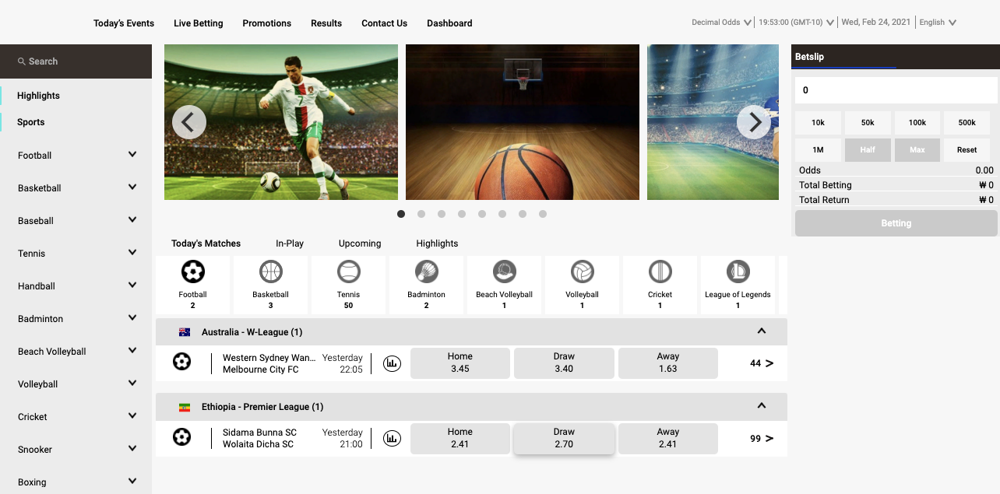
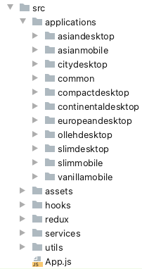

# Platform 8 Web (Soyuz)

This project provides a set of player application websites powered by the Platform 8 (P8) API Engine and CMS.

--------------------------

## Project Introduction

**Technologies**:

* React 18.0.x
* ES2015 (no Typescript)
* Redux Toolkit, with async thunk for API interaction (NO redux sagas)
* Axios for API interaction
* CSS/SCSS Modules for defining styles

**Notable libraries**:

* _dayjs_ for date formatting.
* _flickity_ and react-responsive-carousel for banner/image carousel implementation.
* _react-simple-animate_ for some animation effects (fade-in, fade-out...).
* _react-webcam_, _react-webcam-barcode-scanner_ and _react-barcode-reader_ - all used for retail interaction with
  peripheral devices.

**Interaction with P8**:

* The product consumes pull APIs out of the P8 /player suite of endpoints:
  * CMS configuration.
  * Player Account Management (PAM) endpoints under /player/acc/${accountId}/***. They allow access to account details,
    account balance, account transaction history. Also, they allow to perform actions on behalf of players, such as
    placing bets, requesting deposits / withdrawals, cashouts, password changes, and others.
  * Sports Data - Asian/European sport trees, coupon data, jackpots...
  * Static or Context data - countries, currencies, languages, list of payment methods, others...


* The product consumes Websocket Push notifications out of the P8 live data feed.

--------------------------

## Development Project Setup

1) Check the project out using your preferred Git client, and attempt to do a:

`npm install`

While undesirable, some libraries might not be officially supported for our version of React, and "npm install" might
hint to run as "`npm install --force`". If that happens, do so.

2) You must create a _.env.development_ file in your root folder. For reference, please check the existing _
   .env.development.example_.

If you are within the Lotus/Betica office network, or connected via the Lotus VPN, please connect to the primary
development server by populating the .env.development file as follows:

`API=http://p8cdev.lotus.local:8080/p8
`

In any other scenario, please connect to the primary development by populating the .env.development file as follows:

`API=http://180.232.20.233:8080/p8
`

3) Initiate your development server by running:

`npm start`

4) It should open a site at localhost:3000, looking like:



Probably you will see a spinning wheel in the center of the page though, indicating that the page does not fully load.
This is a known issue with the dev proxy, related to this
issue https://github.com/chimurai/http-proxy-middleware/issues/112. The workaround is just to
open http://localhost:3000/ws/live (over browser or command line GET) once. After that, the proxy is properly loaded and
you could refresh the main localhost:3000 site cleanly.

If this does not work well or you have errors, please provide a screenshot of your network tab to your contact person or
team lead for further troubleshooting. Typically, issues would be related to proxies at this point.

5) You should see this kind of messages in the console under normal circumstances:

[HPM] GET /ws/live -> http://180.232.20.233:8080/p8
[HPM] GET /sockjs-node -> http://180.232.20.233:8080/p8
[HPM] Upgrading to WebSocket
[HPM] GET /ws/live -> http://180.232.20.233:8080/p8
[HPM] Upgrading to WebSocket
[HPM] GET /player/sports?originId=3&lineId=2 -> http://180.232.20.233:8080/p8
[HPM] GET /player/ept/ccoupon?originId=3&lineId=2 -> http://180.232.20.233:8080/p8
[HPM] GET /player/sdc/sFOOT?originId=3&lineId=2&eventType=GAME&toDate=2021-02-03T20:59:59.122+00:00&shortNames=1
-> http://180.232.20.233:8080/p8
[HPM] GET /player/sdc/sFOOT?originId=3&lineId=2&eventType=GAME&from=1612368322686&toDate=2021-02-03T20:59:59.122+00:
00&shortNames=1 -> http://180.232.20.233:8080/p8

The application consumes both regular REST API messages, and WebSocket pull messages. Messages related to both would be
seen in the logs.

 
--------------------------

## Available Scripts

In the project directory, you can run:

### `npm start`

Runs the app in the development mode.\
Open [http://localhost:3000](http://localhost:3000) to view it in the browser.

The page will reload if you make edits.\
You will also see any lint errors in the console.

### `npm test`

Launches the test runner in the interactive watch mode.\
See the section about [running tests](https://facebook.github.io/create-react-app/docs/running-tests) for more information.

### `npm run build`

Builds the app for production to the `build` folder.\
It correctly bundles React in production mode and optimizes the build for the best performance.

The build is minified and the filenames include the hashes.\
Your app is ready to be deployed!

See the section about [deployment](https://facebook.github.io/create-react-app/docs/deployment) for more information.


---------------------

## Project Information

- [Development Principles - Redux](./documentation/development-redux.md)
- [How to Write Unit Tests](./documentation/development-tests.md)
- [How to Implement Localization](./documentation/development-multilingual.md)
- [How to Add and Update Themes](./documentation/development-themes.md)

## Directory Structure

### Folder structure

#### Page Components

Each pages should be in separated folder with name: `CamelCasedPage`.

#### Components

Structure folder:

```
camelCasedComponent
      | components
          | index.js
      | styles (if needed)
      | utils (if needed)
      | index.js
```

Note: Keep components as simples as possible. Additional `business logic/helper` function should be located in `/utils` folder.
Common `components/hooks/helper` functions should be moved to an appropriate folder.

##### Redux folders

- Selectors
  Retrieving logic from store should be done via `createSelector` (for optimization purposes) function and moved in `reselect` folder.
  Selector file pattern: `XXXX-selector.js`, where `XXXX` an appropriate reducer name.

  `Bad`: referralsSelectors.js
  `Good`: referral-selector.js

- Redux Slice
  Slice file pattern: `XXXX-slice.js`, where `XXXX` an appropriate slice name.

  `Bad`: referralsSlice.js
  `Good`: referral-slice.js

  For `slice` methods, the pattern: `camelCasedSlice.js` should be applied.
  All slices should have `Slice` suffix.

  `Bad`:
  ```javascript
  const sport_slice = createSlice({});
  ```

  `Good`:
  ```javascript
  const sportSlice = createSlice({});
  ```

- Hooks
  Pattern: `XXX-hooks.js`

  `Bad`: referralsSomeHook.js
  `Good`: referral-some-hooks.js


We will explain the concept of "different websites" in the next section.

### One model, multiple sites

Different clients using the Platform 8 solution might require different looking desktop/mobile web solutions. While we
offer standard demo websites that operators can choose from, it's all too common for operators to desire a custom /
differentiated product, beyond what the CMS would allow.

In this scenario, a new website must be written. However, and while the views might look very different, the application
model (and it's interaction with the P8 Engine APIs) will be the same.

For that reason, this product is intended as a solution that allows to create a new set of views/controllers on top of a
reusable model.

To be able to switch from one application to another, 2 sets of rules are considered:

1) CMS configuration (where the Mobile and Desktop web applications are defined).
2) The screen size (mobile vs larger screen size).

Based on the above, one application or another will be served.

Notice that, unless the look-and-feel and expected features are very similar, we would typically have different
applications for desktop and mobile. I.e. the sites are not responsive, but adaptative, where the routing to one
application or another is driven by React breakpoint and CMS rules (not pure CSS breakpoint rules).

You can see how this works by opening localhost:3000 in your browser, and reducing your browser width as much as you can
- you will see how it transitions from a desktop-specific site to a mobile-specific site.

So to summarise, we can add new "applications" (i.e. variants of similar websites with same API usage, etc), and then
based on config have one version or another run in a specific URL.

Finally - you can see how this works in App.js. There, we first identify the screen size, and then decide what
application to show based on the CMS defaults.

## Application Initialisation

Besides the application to load, a number of actions are performed in the App.js.

1) Load all initial CMS configuration.

For first time users (on a given browser or device), initialise (in redux/local storage) the target currency, language,
price format (for price display formatting) and timezone offset (for API request localisation).

2) Load the list of sports.

3) If the user is logged in - load the user balance (native balance or third party balance).

4) If query parameters are provided, automatically login the user and set defaults as indicated in the query parameters.
   This is done when the site is opened as an iframe (where the parent frame sets a number of initialisation parameters)
   .

## Coding Standards

* ES2015 - no Typescript.
* ESLint + Prettier in place.
* Create components with an index file.
* For mobile applications - use native date pickers.
* For icons - we have a OmegaIcons font, providing custom icons. Other than that, icons are expected to come from
  FontAwesome.
* Avoid large libraries. Discuss and seek approval for any new libraries. Avoid duplicated libraries (i.e. multiple date
  pickers, multiple date formatting libraries, etc) unless strictly required. Cumulative library size would increase the
  download time for users, and degrade the experience.

## Code Conventions

### Comments

- Help to understand `WHY`, not `WHAT`!
- Grammatically correct.

### Commit Messages

A properly formed git commit subject line should always be able to complete the following sentence:

`If applied, this commit will <COMMIT_MESSAGE>.`

_Example: If applied, this commit will `add redux auth slice`._

### Imports

Use absolute imports, excluding relative paths maximum of two levels higher in folder structure. If your needed file is
deeper in relative folder you should also use relative path.
_Example:

* If the utils file is in the same folder as the file you are working on use `./utils`;
* If the "Panel" component is in folder that is relative to the file you are working on use `./components/Panel`;
* If the utils file is two levels higher in folder structure use relative path `../../utils`;
* In all other cases use absolute path with "src" as a root
  folder: `applications/slimmobile/common/components/ItemDropdown`.

To know
more: [http://dev.to/mr_frontend/absolute-imports-in-create-react-app-3ge8](http://dev.to/mr_frontend/absolute-imports-in-create-react-app-3ge8)

### React

#### Sort order of propTypes/defaultProps/object destructuring

- alphabetic
- getAlphabetic
- setAlphabetic
- onAlphabetic
- renderAlphabetic
- ComponentAlphabetic

#### Constants

- Should be snake_case and uppercase all letters;
- Constants for action/styles or etc. preferred to declare in `constants`
  folder.
- Constants for `CMS` config types:
  pattern: `CMS_` + `_CONFIG_TYPE` + `_TYPE`;

  `Bad`:
  ```javascript
  const CMSCONFIGTYPEBRANDDETAILS = "CMSCONFIGTYPEBRANDDETAILS";
  const cmcConfigTypeBrandDetails = "cmcConfigTypeBrandDetails";
  ```

  `Good`:
  ```javascript
  const CMS_CONFIG_TYPE_BRAND_DETAILS = "CMS_CONFIG_TYPE_BRAND_DETAILS";
  ```

#### Hooks

Pattern: `useCamelCased`

Bad:

```javascript
const use-auth-hook = () => {};
```

Good:

```javascript
const useAuth = () => {};
```


#### Fetch

- Fetch functions should be named in camelCase style.
- Fetch functions should be written using async/await.
- Properties of the response should be sorted alphabetically.

`Bad`:

```javascript
export const getlanguages = 
  createAsyncThunk("languages/loadLanguages", async (data, thunkAPI) => {
    return createAxiosInstance(thunkAPI.dispatch).get(
      `/player/languages?originId=${originId}&lineId=${lineId}`,
    ).then(data=>result.data);
```

`Good`:

```javascript
export const getLanguages = createAsyncThunk("languages/loadLanguages", async (data, thunkAPI) => {
  try {
    const result = await createAxiosInstance(thunkAPI.dispatch).get(
      `/player/languages?originId=${originId}&lineId=${lineId}`,
    );
    return {
      languages: result.data,
    };
  } catch (err) {
    const customError = {
      name: "Languages List Fetch Error",
      status: err.response.statusText,
      message: err.response.headers["x-information"] || "Unable to obtain language details",
    };
    throw customError;
  }
});
```


## CSS

CSS Modules used for loading stylesheets. Please see the official create-react-app CSS modules
documentation (https://create-react-app.dev/docs/adding-a-css-modules-stylesheet/). Notice how scss files must have a *
.module.scss name format for them to be properly identified and loaded.

You can see the code uses classes['xxx'] to load classNames.

## Spinners

We have a Spinner.js component that can be used to provide feedback to the user while an async action is being
performed.

## Sport Icons

We have our regular sport icons under OmegaIcon.css. These are a compilation of icons
from https://materialdesignicons.com and  https://www.flaticon.com.

## Authentication

A user logged in state is tracked through authentication tokens.

When the user logs in or creates an account, the P8 API will provide a response header (X-Token) containing an
authentication token.

This token is renewed every time the user performs an authenticated action (for example, refresh his balance, or perform
a financial transaction).

Further to this, the user will be providing this token as a request header (X-Token) in every API request he performs.
This uniquely identifies the user against the P8 API endpoints.

Tokens are time limited - if a user does not interact with the website, he will eventually be logged out.

Tokens are persisted in the local storage and will keep a user logged in across page refreshes for as long as the token
remains current (i.e. for as long as it does not expire).

To see the process leading to a login state, and how the tokens are provided in the request headers and collected out of
the response headers, please check the authSlice.js and axios.js files.

## CMS

The P8 CMS allows customising the player interfaces. This includes, among others:

* Web logo and favicon.
* Defaults: Languages, countries, enable/disable sections, navigation menus...
* Account registration requirements (accepted and mandatory registration fields).
* Site appearance (available and default desktop and mobile views (applications), fonts, colour palette).
* Betting configuration and limits.
* Ability to configure the application page layouts, and customise the widgets to display in each page column.

The P8 CMS configuration is provided via API, and loaded in the App.js as a precondition to serving any application to
the player.

## Proxies - development and production

- The site proxies API and WebSocket requests towards a backend API server / load balancer.
- For development purposes - this is configured and can be seen under the setupProxy.js file.

## Production Setup

- Production builds are generated with "`npm install`", "`npm audit fix`" and "`npm run build`".
- Production builds will typically be deployed to Apache web server farms (2 or more Apache servers).
- Proxy configuration is handled by Apache.

## Retail Applications

Both Betpoint and Slipstream require the usage of a Java wrapper/util. Please refer to the RingFence or BridgSocket
project documentation for more details on this matter.

The applications load the UUID for their till (a unique machine ID) off RingFence and Betpoint. Check the BetpointApp
and the SlipstreamApp usage of the useRetailUUID hook for more details.

We also use the Java wrapper as a bridge to the printer. Notice that historically we also used it for barcode reader,
NFC reader and Web Cam, but those functions are now directly managed at React level. Notice the printing function is
considered deprecated now, and pending migration to the EPOS JS SDK (
example: https://dev.to/rubenruvalcabac/printing-tickets-on-reactjs-ki6).

--------------------------

## Google Analytics

Some applications have support for Google Analytics 4.

Library:

* React-GA4 - https://github.com/PriceRunner/react-ga4
* Note - we can review the legacy library documentation too (not the one we use, but better
  documented): https://github.com/react-ga/react-ga
* Note - we are using the latest Google Analytics 4 with Measurement ID (not the Universal Access legacy/bridge version)
  .
* Note - this library provides no support for the Enhanced E-Commerce Google Analytics module

Google Analytics Documentation (external):

* Analytic.js Field Reference
  - https://developers.google.com/analytics/devguides/collection/analyticsjs/field-reference#dimension
* "Event" reference - https://developers.google.com/tag-platform/gtagjs/reference/events#purchase
* How to record a "purchase" event - https://developers.google.com/analytics/devguides/collection/ga4/set-up-ecommerce
* How to Debug our calls (check what is being received by
  Google): https://wendeehsu.medium.com/google-analytics-in-react-js-c1b78dc1bbda

View your Google Analytics:

* https://analytics.google.com
* Test credentials for HitBet (dev): hitbetdev.analytics@gmail.com / 13krroPZcbWSZe
* Note that custom events required (notes in Evernote).

Relevant code files:

* google-analytics-utils.js
* google-analytics-hooks.js

Implementation principles (for existing or future apps):

* Run the instance with these 2 variables (to be moved into the CMS in the future):

```javascript
  REACT_APP_GOOGLE_ANALYTICS_ON=true 
  REACT_APP_GOOGLE_ANALYTICS_MEASUREMENT_ID=G-VY5QYSKDJJ # Depends on your google analytics account - this is an example for HitBet dev
```

* Run this in the top level of any app wanting to track with Google Analytics:

```javascript
  useReactGA(process.env.REACT_APP_GOOGLE_ANALYTICS_MEASUREMENT_ID);
```

* Track page changes in any relevant route as follows:

```javascript
  useGAPageView(" Page Name ");
```

* Track user clicks (actions / interactions)

```javascript
  gaEvent(" Category ", " Action ", " Label ", value, true); // value is an optional amount
```

* Track user bet placements:
  * Trigger it when a bet confirmation is received.
  * Records bet income in the Google Analytics monetization views.

```javascript
  gaTrackBet(currencyCode, totalStake, betslipReference, betsliData.model.outcomes);
```

* Troubleshooting:
  * You can always enable debug mode to see what messages arrive to GA (see the google-analytics-hooks.js for reference)
    .
  * Ad Blockers can prevent the execution of google analytics. We do not have any sort of Google Tag Manager server
    container workaround.

* Ad blocker protection
  We have an account with https://admin.dataunlocker.com/.
  There you can add a new property (website).

Notes:

1) Add a new property per subdomain (for example www. and the root are different). For our standard cloudflare, we do
   not require this, as there is only base now.
2) Disable Cloudflare strict SSL validation and use "full" instead (required for the next step).
3) Add a CNAME in Cloudflare as per the DataUnlocker "property add" instructions.
4) Add a build step (as per the instructions for CONTINUOUS INTEGRATION - dynamic script - in the dataunlocker property
   add instructions)
5) Confirm by clicking around... Notice the original calls to google analytics / collect still take place (which works), but then there is a subsequent additional proxy call (which succeeds).

--------------------------

## Google Analytics Upgrading dependencies

Command line -->

```
ncu -i
```

--------------------------

## Application Links (Dev)

### CMS (Dev env)

http://180.232.20.233:8892

Test credentials:
* Username: _p8_
* Password: _a_

### Back-office (Dev env)

http://180.232.20.233:8891


Test credentials:
* Username: _p8_
* Password: _a_

### Deployed Player Website (Dev env)

http://180.232.20.233:7020

Test credentials:
* Username: _lotususer1 / lotususer2 / lotususer3 / lotususer4 / lotususer5 / lotususer6 / lotususer7 / lotususer8 / lotususer9_
* Password: _a_


--------------------------

## Learn More

You can learn more in
the [Create React App documentation](https://facebook.github.io/create-react-app/docs/getting-started).

To learn React, check out the [React documentation](https://reactjs.org/).

### Code Splitting

This section has moved here: [https://facebook.github.io/create-react-app/docs/code-splitting](https://facebook.github.io/create-react-app/docs/code-splitting)

### Analyzing the Bundle Size

This section has moved here: [https://facebook.github.io/create-react-app/docs/analyzing-the-bundle-size](https://facebook.github.io/create-react-app/docs/analyzing-the-bundle-size)

### Making a Progressive Web App

This section has moved here: [https://facebook.github.io/create-react-app/docs/making-a-progressive-web-app](https://facebook.github.io/create-react-app/docs/making-a-progressive-web-app)

### Advanced Configuration

This section has moved
here: [https://facebook.github.io/create-react-app/docs/advanced-configuration](https://facebook.github.io/create-react-app/docs/advanced-configuration)

### Deployment

This section has moved
here: [https://facebook.github.io/create-react-app/docs/deployment](https://facebook.github.io/create-react-app/docs/deployment)

### `npm run build` fails to minify

This section has moved
here: [https://facebook.github.io/create-react-app/docs/troubleshooting#npm-run-build-fails-to-minify](https://facebook.github.io/create-react-app/docs/troubleshooting#npm-run-build-fails-to-minify)

--------------------------
